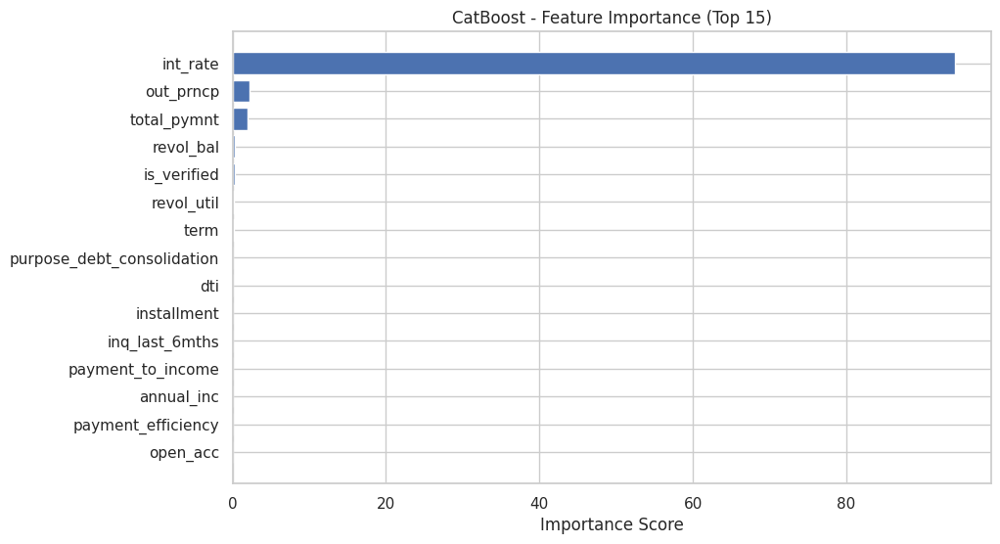

# Credit Risk Scoring: Predicting Loan Default 💳📉

This project focuses on developing a robust predictive framework to identify the probability of loan default. It explores a variety of methodologies, ranging from traditional statistical models to advanced Machine Learning and Deep Learning architectures.

Developed as part of the **Credit Risk Modeling** course in the **Post-graduation in Data Science for Finance (NOVA IMS)**.

## 🎯 Project Objective
The primary goal is to classify borrowers into "Default" or "Non-Default" categories based on historical credit data. Accurate risk scoring is essential for financial institutions to optimize lending decisions and minimize capital losses.

## 🛠️ Methodology & Data Pipeline

A critical focus of this project was ensuring the integrity of the evaluation process by preventing **Data Leakage**:
* **Target Transformation:** The original `loan_status` was mapped into a binary target (0 = Non-Default, 1 = Default).
* **Stratified Splitting:** Data was split into Training and Validation sets using stratification to preserve the class distribution.
* **Independent Preprocessing:** All feature transformations (scaling, encoding, imputation) were fitted strictly on the training set and subsequently applied to the validation/test sets.

### 1. Exploratory Data Analysis (EDA)
* Analysis of the **Analytical Base Table (ABT)** containing features such as loan amount, interest rates, debt-to-income (DTI) ratios, and employment history.
* Visualization of target imbalances and correlation analysis between financial indicators.

### 2. Feature Engineering
* Handling missing values and outliers in sensitive financial data.
* One-Hot Encoding for categorical variables like `grade`, `home_ownership`, and `purpose`.
* MinMax Scaling for numerical consistency across models.

### 3. Model Zoo
We implemented and compared several architectures:
* **Statistical Baseline:** Logistic Regression.
* **Tree-Based Ensembles:** Random Forest, Gradient Boosting, and **XGBoost**.
* **Specialized Gradient Boosting:** **CatBoost** (optimized for categorical features).
* **Deep Learning:** Multi-layer Perceptron (MLP) implemented via **TensorFlow/Keras**.

## 📊 Evaluation & Results
The models were benchmarked using metrics crucial for credit risk:
* **ROC-AUC Score:** Primary metric to evaluate the model's ability to distinguish between default and non-default risks.
* **F1-Score & Recall:** Focused on the "Default" class to minimize the cost of false negatives (Type II error).
* **Confusion Matrix:** Detailed analysis of misclassification patterns.

The **CatBoost** model emerged as the top performer, demonstrating superior handling of the complex, high-dimensional categorical features inherent in credit applications.

*Figure: Top features driving the default prediction (e.g., Interest Rate, Out of Principle, Total Payment).*

---

## 💻 Tech Stack
* **Python:** Core programming.
* **Data Science:** Pandas, NumPy, Scikit-Learn.
* **ML Frameworks:** XGBoost, CatBoost.
* **Deep Learning:** TensorFlow (Keras).
* **Visualization:** Matplotlib, Seaborn.

---

## 📂 Project Structure
* `credit_risk_analysis.ipynb`: Full pipeline including EDA, data cleaning, model training, and evaluation.
* `visualizations/`: Plots showing feature importance and model performance metrics.

---
**Authors:** [Petr Terletskiy](https://www.linkedin.com/in/petr-terletskiy/), Francisco Perestrello, Gonçalo Gomes, Nuno Vieira.  
**Context:** Post-graduation in Data Science for Finance (NOVA IMS - 2024/25)
